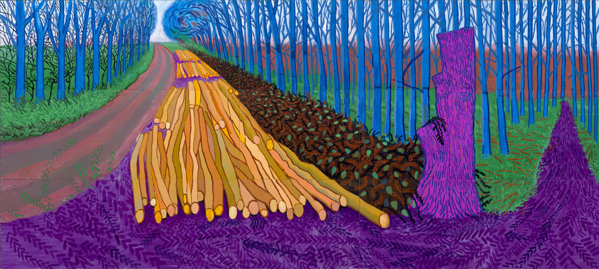

<h1 style="text-align: center;">✨eliazzo✨</h1>

#### Hi there 👋 My name is Elisabeth (she/her/they) and I am an aspiring software developer. I graduated in July 2022 from the University of Manchester with a BA in Linguistics and Spanish. I have just started Founders and Coder's Skills Bootcamp and hope to secure a software development apprenticeship over the next few months. My interests outside of coding include but are not limited to
- Yoga ⚡ Fun fact: I'm a qualified yoga instructor 🧘
- Travel
- Languages (I speak Spanish and a goal of mine is to learn French)
- Food 🌶️ 🍤 🍋 🍜 🥐 🥑 (Cooking AND eating)

🌱 I’m currently learning the fundamental skills of software development. Check out [my profile](https://github.com/eliazzo) to follow my learning journey! 

## Read my [CV](https://eliazzo.github.io/Website-2/CV%20FAC.pdf)

📫 How to reach me:
> [LinkedIn](https://www.linkedin.com/in/elisabeth-azzopardi-b3496a247/)

> [Email](bethazz@hotmail.co.uk)

<!--
**eliazzo/eliazzo** is a ✨ _special_ ✨ repository because its `README.md` (this file) appears on your GitHub profile.

Here are some ideas to get you started:

- 🔭 I’m currently working on ...
- 🌱 I’m currently learning ...
- 👯 I’m looking to collaborate on ...
- 🤔 I’m looking for help with ...
- 💬 Ask me about ...
- 📫 How to reach me: ...
- 😄 Pronouns: ...
- ⚡ Fun fact: ...
-->
